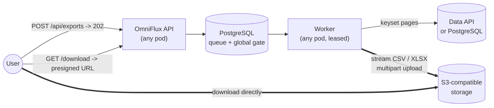

# OmniFlux Exchange

**Export millions of rows to CSV or Excel without ever holding the file in
memory or on disk.**

OmniFlux Exchange is a Spring Boot 4 / Java 25 service that streams allowlisted
relations from a governed Data API (REST) or PostgreSQL (R2DBC) into CSV or XLSX
objects in S3-compatible storage. Users then download them through short-lived
presigned URLs. Jobs are durable, globally rate-limited across replicas, and
coordinated through leases and fencing. Completed correctness fixes and remaining
implementation limitations are recorded in [Implementation status](docs/IMPLEMENTATION_STATUS.md).

## Why it exists

The usual approach to "export a big table" builds the file in memory or in a
temp file and returns it over HTTP. At scale that OOM-kills or evicts the pod,
ties up connections for minutes, and loses work on every deploy. OmniFlux
replaces each of those weak points:

| Instead of | OmniFlux does |
|---|---|
| Whole file in memory | Fixed-size buffers and end-to-end back-pressure: memory stays flat whatever the row count (1M-row XLSX peaked at about 92 MiB heap) |
| Temp files on the pod | Zero disk: streaming CSV and hand-written streaming XLSX go straight into an S3 multipart upload |
| Download through the service | A presigned URL; object storage serves the bytes |
| In-memory or per-pod job queue | A PostgreSQL queue with a **global** concurrency gate across all replicas |
| "The worker timed out, so it must be dead" | Leases and claim tokens reject database updates after ownership changes; current boundary gaps are documented |
| Discovering misconfiguration in production | The app refuses to boot if the memory arithmetic or limits cannot hold |



[Open full-size diagram](docs/assets/diagrams/README-01.svg)

## Quick start

Requirements: Docker Desktop (or Docker Engine) with Compose v2. On Windows,
PowerShell 7. On Linux, macOS, or Git Bash: OpenSSL, `curl`, and Python 3.

```powershell
git clone https://github.com/KannanThiraviam/OmniFlux-Exchange.git
cd OmniFlux-Exchange
pwsh -File scripts/up.ps1 -Build
```

```sh
git clone https://github.com/KannanThiraviam/OmniFlux-Exchange.git
cd OmniFlux-Exchange
chmod +x scripts/up.sh scripts/smoke.sh mvnw
./scripts/up.sh
```

The script creates `.env` with random local credentials and a matching
PostgREST JWT, starts PostgreSQL, PostgREST (Data API stand-in), SeaweedFS
(S3), and the app, waits for health, then runs a real export and download as a
smoke test. Open <http://localhost:8080> in a browser on that computer for the dashboard and
<http://localhost:8080/swagger-ui.html> for the API.

Run the tests (Docker required; the suite starts its own containers):

```sh
./mvnw -B verify          # Windows: .\mvnw.cmd -B verify
```

Docker Engine must be running. Testcontainers starts separate PostgreSQL and
SeaweedFS containers and supplies test connection settings automatically; the
Compose stack, `.env`, and manually set application environment variables are
unnecessary. See [Integration tests and Testcontainers](docs/QUALITY_GATES.md#integration-tests-and-testcontainers)
for setup, lifecycle, and troubleshooting.

Stop with `docker compose down`. Add `-v` only if you want to delete local data.

For the first manual export, choose **Data > mock_customers**, add `id at most 3`, select CSV or XLSX, and click Export. Open **Jobs**, wait for **Completed**, and click **Download**. The [step-by-step setup guide](docs/GETTING_STARTED.md) explains expected output and troubleshooting; [Local data and storage](docs/LOCAL_DATA.md) explains how to inspect the backend.

## Documentation

**[Read the documentation site](https://kannanthiraviam.github.io/OmniFlux-Exchange/)** - searchable guides, architecture, design, and operations. Start with the [documentation home](docs/index.md) when browsing this repository.

| Start here | |
|---|---|
| [Technology and tools](docs/TECH_STACK.md); [Key concepts](docs/concepts.md) | Stack, tools, Flyway, and terminology |
| [Local data and storage](docs/LOCAL_DATA.md) | Browser endpoints, PostgreSQL queries, and storage inspection |
| [Overview](docs/architecture/overview.md) | Problem, benefits, C4 diagrams, export lifecycle, FAQ (files vs object storage, SeaweedFS vs MinIO, why not Kafka) |
| [Principles and patterns](docs/architecture/principles-and-patterns.md) | First principles and design patterns, each mapped to the code |
| [Architecture](docs/architecture/architecture.md); [Low-level design](docs/architecture/low-level-design.md); [ADRs](docs/adr/README.md) | How it works and why |
| [Getting started](docs/GETTING_STARTED.md); [API](docs/API.md); [Operations](docs/OPERATIONS.md) | Run it, call it, operate it |
| [Threat model](docs/THREAT_MODEL.md); [Security](SECURITY.md) | Trust boundaries and deployment requirements |
| [All docs](docs/README.md); [Contributing](CONTRIBUTING.md); [Changelog](docs/CHANGELOG.md) | Everything else |

## Scope and limits (v1)

- **Authentication is delegated to a trusted gateway** (`HEADER` mode). Native
  JWT validation is not implemented yet, and `auth-mode=JWT` refuses to start.
  Do not expose the service except through the gateway. See
  [SECURITY.md](SECURITY.md).
- XLSX is a single worksheet capped at 1,000,000 data rows; CSV has no XLSX-style row cap, but output byte limits still apply.
- Keyset paging needs an integer unique key per relation.
- SeaweedFS is the local and test S3 fixture only. Production uses IBM COS or
  AWS S3 through configuration.
- The OpenShift manifests in `deploy/openshift` are templates
  (`oc apply -k deploy/openshift`) and need environment-specific endpoints and
  secrets.
