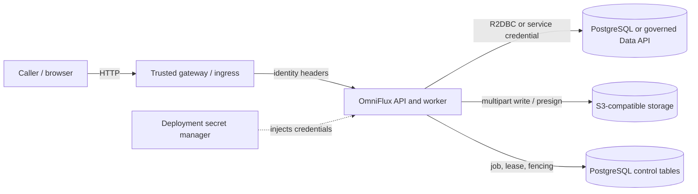

# Threat model

This is a v1 boundary review for deployment planning, not a claim of a completed security certification. It describes the current implementation and the controls an operator must provide.

## Assets and trust boundaries

- Source data and source credentials at PostgreSQL or an upstream Data API.
- Export objects and multipart uploads in S3-compatible storage.
- PostgreSQL job rows, caller snapshots, idempotency keys, and attempt history.
- Caller identity, tenant, roles, authorization-context version, and client IP.
- Service availability and resource budgets (heap, queue capacity, storage).

[Open full-size diagram](assets/diagrams/docs-THREAT_MODEL-01.svg)

## Current security posture

The job queue scopes reads/actions to the resolved principal; schema metadata and requested identifiers are validated against the configured relation/column catalog; SQL values are bound parameters; and workers use leases plus fencing tokens to prevent stale attempts from overwriting newer state. Export objects are private by deployment configuration and downloaded through short-lived presigned URLs. Local Compose uses throwaway credentials and enables a demo principal.

JWT resource-server validation and application-managed entitlements are not implemented. `HEADER` mode is a trust handoff: if untrusted callers can reach the app or supply accepted `X-Auth-*` values through the gateway, they can impersonate another principal. The disabled/demo mode provides no caller authentication. Production readiness therefore depends on a trusted gateway, network restrictions, and a deliberate identity integration.

## Main threats and mitigations

| Threat | Existing control | Required deployment control / gap |
|---|---|---|
| Caller forges another user's identity | Header provider validates required identity fields and job ownership uses the principal key | Authenticate at gateway, strip all inbound identity headers, set trusted values, block direct app access; implement JWT/resource-server auth before direct exposure |
| Caller requests unauthorized relation/column | Schema catalog allowlist and metadata validation | Maintain an allowlist from approved views; keep source DB roles least-privileged; v1 does not implement row-level entitlements itself |
| SQL injection via filters/identifiers | Values are bound; identifiers must resolve from catalog metadata | Keep supported metadata providers and dialects constrained; review any new query operator |
| Cross-tenant job access | Job lookups/actions are scoped to caller principal | Preserve issuer/tenant/subject mapping at gateway; test ownership on every new endpoint |
| Presigned URL disclosure | Short configured expiration; URLs minted on demand and not stored | Treat URLs as secrets; use TLS, avoid logging/copying them, align bucket lifecycle/permissions |
| Resource exhaustion via large/parallel exports | Row/object bounds, bounded demand, queue depth, global DB admission gate, lease/retry controls | Set production limits to actual capacity; alert on queue growth, retries, lease expiry, and storage failures |
| Malicious/untrusted source data | Field/row limits, output character rules, spreadsheet-safe CSV mode, XLSX row/cell constraints | Prefer `SPREADSHEET_SAFE` for user downloads; validate upstream trust and content expectations |
| Credential theft | Credentials are externalized to environment variables | Inject from secret manager, rotate, scope per service, never commit `.env` or expose secrets in diagnostics |
| Forwarded client IP spoofing | Forwarded-header strategy only in production profile | Ingress must overwrite forwarded headers and be the sole route; audit client IP is not a substitute for identity |
| Dependency or image compromise | Maven/dependency and image configuration are checked in | Pin and scan production images/dependencies; establish patch/update policy |

## Out of scope for v1

JWT validation, fine-grained entitlement evaluation, multi-sheet XLSX, and a formal audit-retention policy are not implemented. Local demo seed and naive-export routes are active only under the `demo` profile. Do not enable that profile in production.
