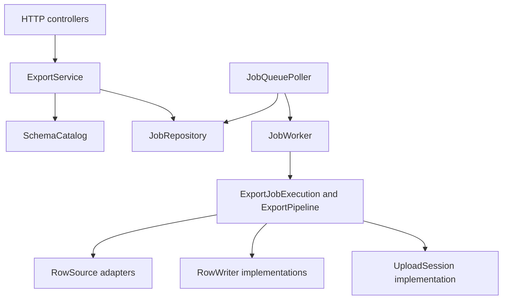
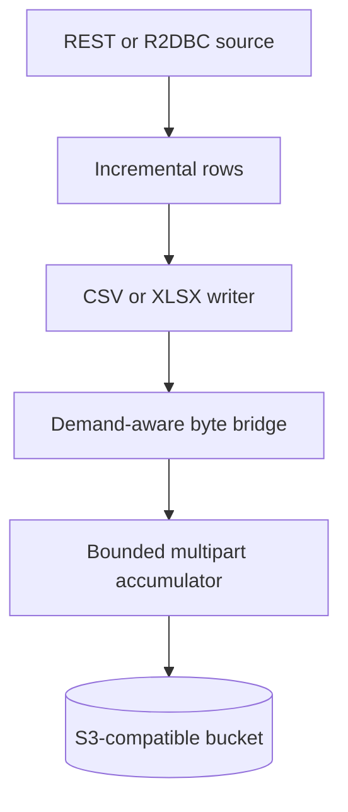
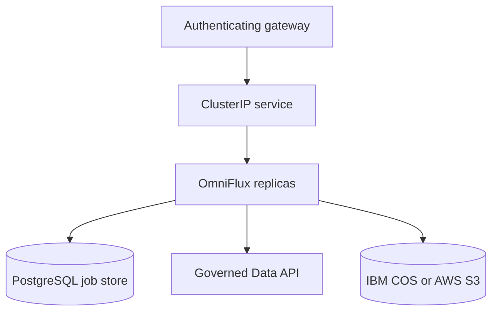

# Architecture

[Documentation home](../index.md) / Architecture / Components and deployment

This page describes the current component boundaries, execution model, and deployment. Start with the [overview](overview.md) for the problem and export lifecycle, then use the [low-level design](low-level-design.md) for interactions and failure paths.

## Component boundaries

[Open full-size diagram](../assets/diagrams/docs-architecture-architecture-01.svg)

| Component | Responsibility | Source |
|---|---|---|
| HTTP controllers | Decode requests and resolve caller identity | [`web`](../../src/main/java/com/omniflux/exchange/web/) |
| ExportService | Validate submissions, resolve cache/idempotency, serve owner-scoped job actions | [`ExportService.java`](../../src/main/java/com/omniflux/exchange/export/ExportService.java) |
| SchemaCatalog | Restrict relations, validate projections and filters, resolve key contracts | [`SchemaCatalog.java`](../../src/main/java/com/omniflux/exchange/meta/SchemaCatalog.java) |
| JobRepository | Admission, claims, state transitions, ownership, and attempt history | [`JobRepository.java`](../../src/main/java/com/omniflux/exchange/job/JobRepository.java) |
| JobQueuePoller and JobWorker | Dispatch claimed jobs, manage execution, and drain on shutdown | [`job`](../../src/main/java/com/omniflux/exchange/job/) |
| LeaseRenewer and ExpiredLeaseSweeper | Renew active ownership and recover expired claims | [`LeaseRenewer.java`](../../src/main/java/com/omniflux/exchange/job/LeaseRenewer.java) |
| ExportPipeline | Bridge blocking row writers into a demand-aware upload publisher | [`ExportPipeline.java`](../../src/main/java/com/omniflux/exchange/export/ExportPipeline.java) |
| PresignService | Issue owner-scoped download URLs using local signing | [`PresignService.java`](../../src/main/java/com/omniflux/exchange/presign/PresignService.java) |

The core uses small ports such as `RowSource`, `RowWriter`, and `UploadSession`. REST, R2DBC, and S3 implementations supply the external integrations. See [principles and patterns](principles-and-patterns.md) for the port mapping and trade-offs.

## Streaming path

[Open full-size diagram](../assets/diagrams/docs-architecture-architecture-02.svg)

Each stage buffers a bounded amount of data. `S3UploadSession` accumulates a configured part and waits for its upload acknowledgement. When downstream demand stops, the byte bridge blocks the writer and row consumption slows. The complete export is never assembled as a single in-memory buffer or a temporary file.

The XLSX writer produces a ZIP archive of OOXML parts with inline strings. Finalizing the ZIP central directory is part of successful export completion. Apache POI is used to read generated files in tests, not to write exports at runtime.

## Threads and scheduling

| Work | Execution context |
|---|---|
| HTTP handling and reactive database/network callbacks | Netty and reactive client threads |
| CSV/XLSX writing and blocking bridge consumer | Dedicated export executor |
| Queue polling, lease renewal, sweeping, and progress flushing | Scheduled tasks initiating reactive database operations |
| Presigned URL generation | Local signing work, without an object-storage network request |

The writer can wait for upload demand. It must run on the dedicated executor so it does not block HTTP processing. Lease renewal is scheduled separately from row/page progress. BlockHound is currently unavailable on the tested Java 25 runtime; executor and demand tests provide the implemented verification boundary.

## Durable state

| Store | Contents |
|---|---|
| `transfer_jobs` | Current request, identity snapshot, state, claim, result metadata, diagnostics |
| `transfer_job_attempts` | Durable history for each claimed execution |
| `admission_gate` | Singleton row locking shared admission decisions |
| S3-compatible bucket | Completed objects and in-progress multipart uploads |

Presigned URLs are minted on demand and are not persisted. The [data model](../data-model.md) covers schema and migrations.

## Deployment topology

[Open full-size diagram](../assets/diagrams/docs-architecture-architecture-03.svg)

The OpenShift template declares three replicas, a rolling update, readiness/liveness probes, a PodDisruptionBudget, and a 60-second termination grace period. Resource requests equal limits for CPU and memory. Containers run as non-root with a read-only root filesystem, dropped capabilities, and a bounded temporary mount.

Ingress is restricted to the gateway namespace. The gateway must authenticate callers, overwrite `X-Auth-*` and forwarded headers, and provide the only application access path. Native JWT validation is not implemented.

Prometheus scraping requires both a collector allowed by network policy and, for `ServiceMonitor`, the Prometheus Operator CRD. Endpoints, secrets, image coordinates, and source allowlists must be adapted before deployment. See [security](../THREAT_MODEL.md) and [operations](../OPERATIONS.md).

## Resource controls

| Control | What it bounds |
|---|---|
| Field and row byte limits | Individual values and decoded rows |
| Incremental decoding and writer demand | Buffered data within an export |
| Object and XLSX row limits | Maximum output size |
| Queue depth | Accepted work waiting for capacity |
| Global admission gate | Concurrent jobs across all replicas |
| StartupValidator | Configured memory arithmetic, multipart part count, cache TTL, auth opt-in |

Memory estimates depend on configuration and measured overhead. They do not certify every workload against every JVM/container limit. The [low-level design](low-level-design.md#memory-budget) shows the configured arithmetic.

## Readiness and known gaps

The implementation includes durable coordination, streaming exports, metrics, and a runnable local fixture. It remains a development baseline. The [implementation status](../IMPLEMENTATION_STATUS.md#known-correctness-gaps) records unresolved query-timeout, lease-publication, and shutdown object-key concerns. The diagrams describe the current mechanisms without treating those gaps as solved.
