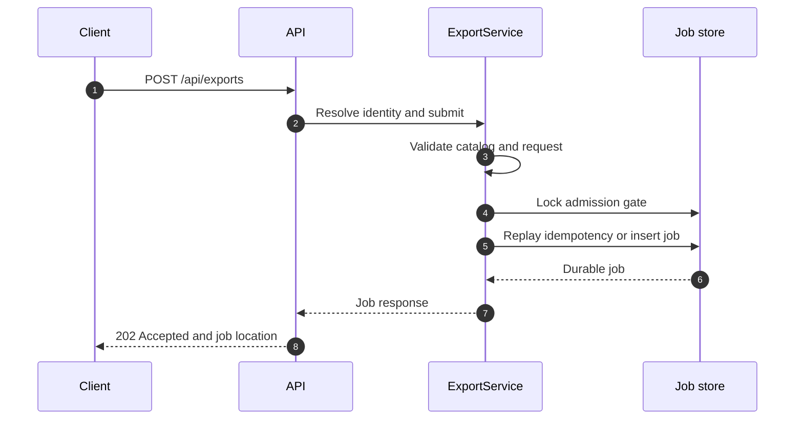
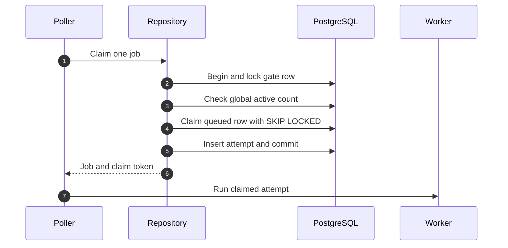
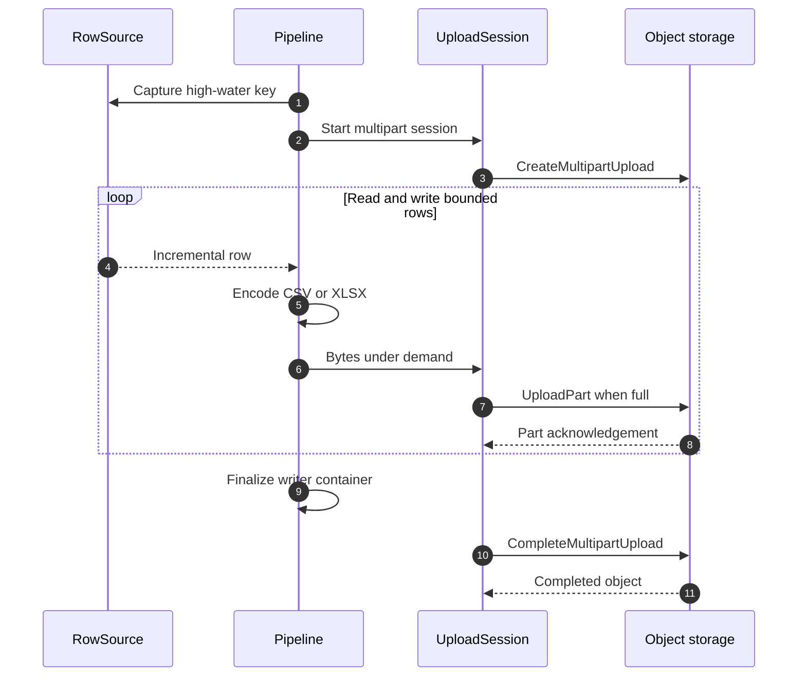
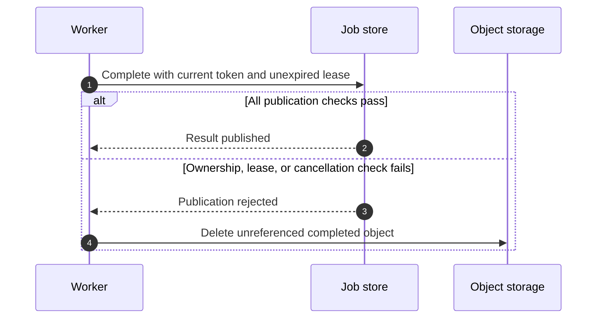
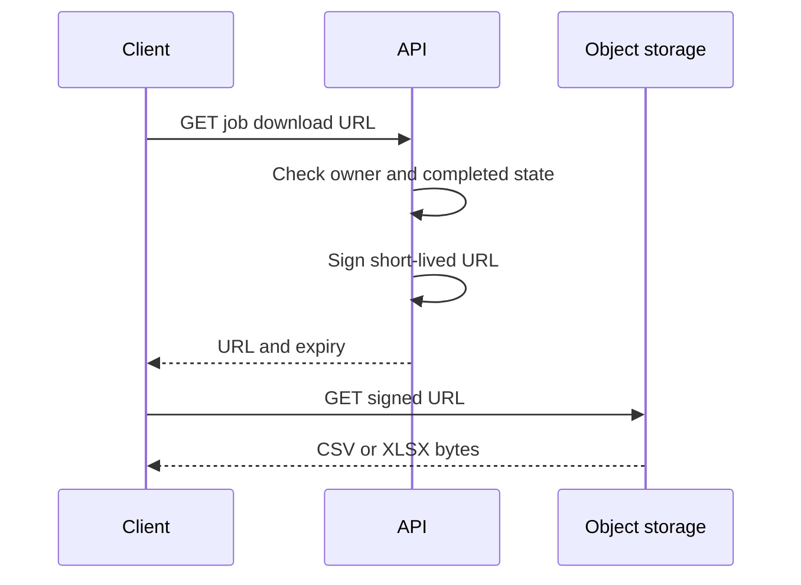
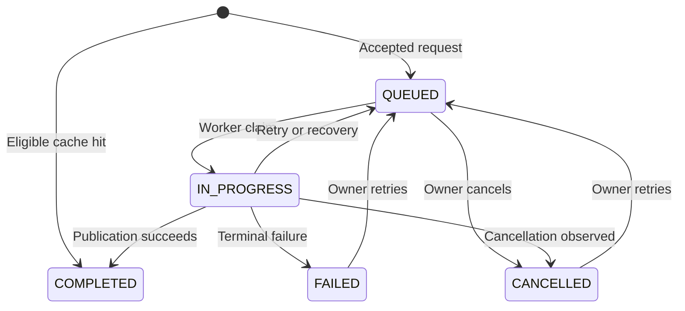

# Low-level design

[Documentation home](../index.md) / Architecture / Low-level design

This page follows one export through submission, claim, streaming, publication, and download. Each diagram covers one phase so labels remain readable. The [architecture](architecture.md) covers component boundaries and deployment. New readers can start with [Key concepts](../concepts.md).

## Request admission

Admission is the decision to accept a request into the durable queue. It checks validity and available queue capacity before promising to run an export.

[Open full-size diagram](../assets/diagrams/docs-architecture-low-level-design-01.svg)

`ExportController` resolves the caller and passes the request to `ExportService`. The service validates relation, projection, filters, and format, then computes the request fingerprint. `JobRepository.submit` serializes queue admission under the gate row lock.

An identical request with the same owner-scoped idempotency key replays the existing job. A different fingerprint under that key returns a conflict. When the optional cache resolves a fresh completed origin, the API inserts a completed cache-hit job and returns `200` with a download URL.

## Worker claim

A worker is the background component that runs an export. Claiming a job records which worker owns the current attempt so other workers can choose different jobs.

[Open full-size diagram](../assets/diagrams/docs-architecture-low-level-design-02.svg)

The transaction locks `admission_gate` before counting active jobs. `SKIP LOCKED` avoids claiming an already-locked candidate, but cannot serialize the active-count predicate on its own. The claim sets `IN_PROGRESS`, increments the retry-budget attempt count, and assigns a fresh token and lease.

## Streaming and upload

Streaming means reading, encoding, and uploading rows in small pieces while the export runs. The service does not build the whole file first. A multipart upload sends those bytes as parts that object storage assembles into one file.

[Open full-size diagram](../assets/diagrams/docs-architecture-low-level-design-03.svg)

`ExportJobExecution` builds the source, writer, and upload session. Both source adapters capture a high-water integer key and scan forward using `key > last` and `key <= high-water`. This excludes later higher-key inserts, but does not create a transactionally consistent snapshot of updates or deletes.

For XLSX, a filtered count under the captured high-water bound checks the product row limit before opening the upload. The writer also enforces its row/cell constraints while producing bytes.

`ExportPipeline` runs synchronous writing on the export executor. `outputStreamPublisher` exposes those bytes as a demand-aware publisher. `S3UploadSession` accumulates parts and sends explicit multipart requests. Default part size is 8 MiB. The configured object ceiling must fit within 10,000 parts.

## Result publication and download

Publication records a completed file as the job result in PostgreSQL. Download then gives the owner a signed, time-limited URL to that file in object storage.

[Open full-size diagram](../assets/diagrams/docs-architecture-low-level-design-04.svg)

Publication stores the object key, counts, SHA-256, high-water key, and completion timestamp. A completed upload cannot be aborted as a multipart session. If publication is rejected, the worker attempts to delete the object. Reconciliation is an additional recovery path for abandoned objects and uploads.

`markCompleted` requires the matching claim token, `IN_PROGRESS` status, no cancellation request, and `lease_until >= clock_timestamp()` at the database update. An expired claim cannot publish even before the sweeper replaces its token.

[Open full-size diagram](../assets/diagrams/docs-architecture-low-level-design-05.svg)

`PresignService` performs local signing and records issuance through an owner-scoped database update. The service does not stream the completed download. The default URL lifetime is 15 minutes.

## Job state machine

A state machine defines the allowed steps in a job lifecycle. It describes when a job can move between waiting, running, completed, failed, and cancelled.

[Open full-size diagram](../assets/diagrams/docs-architecture-low-level-design-06.svg)

| Transition | Conditions |
|---|---|
| Claim | Queue has work and global admission has capacity. |
| Automatic retry | Failure is transient and the configured attempt budget remains. |
| Expiry recovery | Sweeper observes an expired lease and requeues or fails at the budget limit. |
| Manual retry | Owner targets a failed or cancelled job and the queue has capacity. The current implementation does not enforce the automatic retry limit on this action. |
| Running cancellation | Owner sets `cancel_requested`. Renewal fails, which stops execution and enables the fenced cancellation transition. |
| Shutdown requeue | Drain expires, execution is cancelled, and the claim is released without spending retry budget. Each new claim has a distinct storage key containing its token. |

## Lease and fencing

A **lease** is temporary permission for one worker to run a job. The job row records when that permission expires in `lease_until`. The worker must renew it while working. If the worker disappears, the deadline lets the system recover the job without waiting forever.

**Fencing** means rejecting updates from a worker that no longer owns the job. Each claim gets a new random `claim_token`, which acts as the worker's ownership credential. Database updates must match the current token. This service uses a UUID token checked in PostgreSQL, rather than a monotonically increasing number checked by object storage.

For example, worker A claims a job with token A, then pauses long enough for its lease to expire. After recovery, worker B claims the job with token B. If A resumes and tries to update the job using token A, its database update affects zero rows because the stored token is now B. Completion also rejects A if its lease has expired before B claims the job. Storage keys include the claim token, so A cannot overwrite or delete B's object even if shutdown restores the attempt counter. Reconciliation identifies abandoned objects by their claim token and protects published keys.

The default lease duration is 60 seconds and renewal interval is 15 seconds. Renewal uses its own scheduler and does not wait for a source page or an upload part. It requires the current token, an active job, no cancellation request, and an unexpired lease.

A worker whose token has been replaced cannot update the replacement claim. Renewal failure cancels the export publisher. The sweeper recovers expired claims. Owner cancellation uses the same execution-stop signal, but the worker checks the persisted cancellation state and reports `cancelled`, including when the sweeper or failure transition completed the cancellation first. A lost claim without cancellation reports `lease_lost`; shutdown disposal reports `shutdown`.

## Memory budget

The memory budget estimates how much memory each active export can use, plus the JVM baseline. Fixed buffers and a concurrency limit keep resource use from growing with the total number of rows.

| REST budget term | Configured estimate |
|---|---:|
| Wire element codec limit | 25 MiB |
| Decoded row allowance | 10 MiB |
| Two bridge chunks | 128 KiB |
| Upload buffer | 16 MiB |
| Measured overhead allowance | 8 MiB |
| Per-job rollup | 59.125 MiB |
| Four jobs plus 64 MiB JVM baseline | 300.5 MiB |

`StartupValidator` checks `global concurrency * max(REST budget, R2DBC budget) + JVM baseline` against the declared and runtime heap ceilings. It also compares the declared heap budget plus non-heap reserve with the cgroup limit when available. These are configured estimates and must remain aligned with workload measurements.

R2DBC guards variable-width values in SQL before retrieving oversized fields. REST decoding uses a per-element codec limit, followed by row/field checks. Neither path collects the full result set.

## Validation and source safety

`SchemaCatalog` restricts relation identifiers and requested columns, requires the integer key contract, and bounds IN lists. PostgreSQL identifiers are quoted and filter values are bound. REST queries encode supported operators and values. Fine-grained row entitlements come from the Data API or configured source database role.

Each R2DBC high-water, count, and page query runs in a transaction with `SET LOCAL statement_timeout` derived from `omniflux.security.query-timeout` (default 30 seconds). A client deadline also bounds connection acquisition and result delivery. Blocked SQL is cancelled in PostgreSQL; transaction completion or rollback restores the previous timeout setting. The deadline applies separately to each query, not the total export duration. Timeout errors use `QUERY_TIMEOUT` and the transient retry policy. The catalog rejects all four service-owned relations even when an operator allowlists them.

## Cache eligibility

The cache lets an eligible request reuse an existing completed export. Eligibility means the stored result belongs to the same authorization context and still satisfies the configured freshness rules.

Caching is disabled by default. Eligible requests require a relation enabled for caching, a matching completed origin within TTL, and an existing object. Mutable relations are rejected. Static relations need no additional freshness probe. Monotonic append-only relations compare the current filtered high-water key with the origin.

The fingerprint includes issuer, subject, tenant, authorization-context version, relation, projection order, normalized filters, format, CSV mode, dialect version, and writer version. Cache-hit rows cannot become new origins or extend the original generation timestamp.

## Failure and recovery

| Failure | Behavior |
|---|---|
| Invalid request | Return a stable error before accepting work. |
| Queue full | Reject admission with `429`. |
| Source or storage transient failure | Stop the upload and requeue while automatic attempts remain. |
| Deterministic row/format failure | Mark failed with diagnostics. |
| Pod dies | Lease expires and sweeper recovers the claim. Reconciliation cleans abandoned storage state. |
| Completed object cannot be published | Try deleting the unreferenced object. Reconciliation provides another cleanup path. |
| Drain timeout | Release the claim and cancel execution. Immutable storage identity still needs correction. |
| URL expires | Owner requests a new signed URL. |

For current verification and unresolved issues, read [implementation status](../IMPLEMENTATION_STATUS.md).
