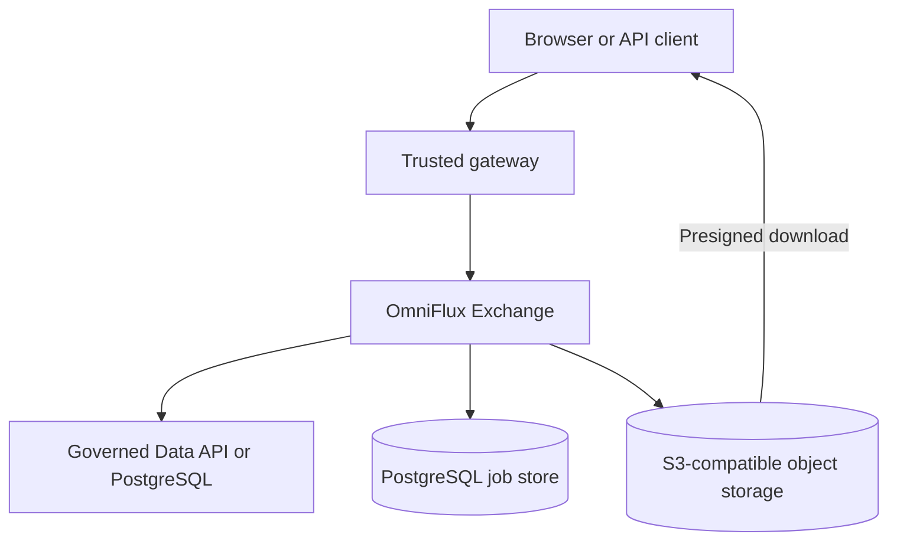
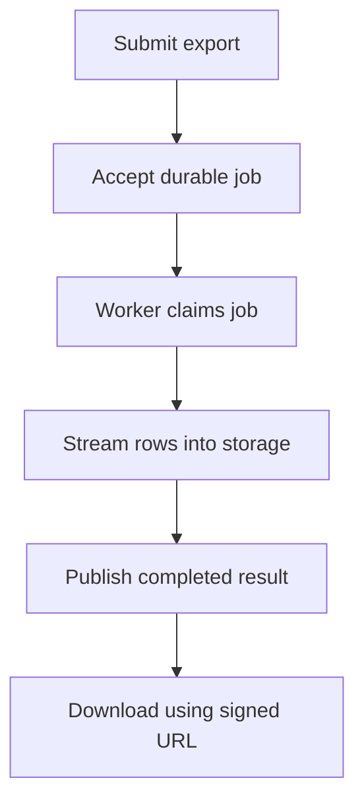

# Overview

[Documentation home](../index.md) / Architecture / Overview

OmniFlux Exchange exports large, allowlisted datasets to CSV or Excel using bounded buffers. It stores the result in S3-compatible object storage and gives the caller a short-lived download URL.

## The problem

A large export must keep working when the dataset exceeds the pod's memory budget. Building the whole file in memory risks an out-of-memory failure. Spooling it to pod disk consumes ephemeral storage. Keeping an HTTP request open for the entire export makes gateway timeouts and deployments part of the export lifecycle.

OmniFlux accepts a durable job, streams rows into object storage, and lets the browser download the completed object directly.

## System context

The gateway authenticates the caller. OmniFlux coordinates the job. The source supplies rows, PostgreSQL stores job state, and object storage serves the completed file.

[Open full-size diagram](../assets/diagrams/docs-architecture-overview-01.svg)

The job store is the **control plane**: requests, ownership, status, and recovery. The row stream and exported object are the **data plane**. Source reads pass through the export worker. Completed downloads go directly from storage to the caller.

## Export lifecycle

[Open full-size diagram](../assets/diagrams/docs-architecture-overview-02.svg)

| Step | Behavior |
|---|---|
| Submit | `POST /api/exports` supplies relation, projection, filters, and format. |
| Accept | The API validates the request and returns `202 Accepted` with a job ID. An eligible cache hit returns `200`. |
| Claim | A worker checks the shared admission gate and claims the job with a lease and token. |
| Stream | Keyset pages feed a CSV or XLSX writer and multipart upload. |
| Publish | A conditional database update records completion and the storage key. |
| Download | The owner requests a signed URL and downloads directly from storage. |

See the [low-level design](low-level-design.md) for the sequences, state transitions, and failure handling.

## Benefits and evidence

| Goal | Mechanism | Evidence or boundary |
|---|---|---|
| Bound memory as row count grows | Incremental reads, fixed buffers, and demand propagation | The [1M-row XLSX proof](../evidence/runs/20260907T005853Z-xlsx-proof/manifest.json) records about 92 MiB peak heap for that workload. This is a measurement, not a guarantee for every configuration. |
| Avoid export spooling | CSV and streaming OOXML write directly into multipart upload | The application container has a read-only root filesystem and a small `/tmp` mount. |
| Bound shared source load | PostgreSQL serializes admission across replicas | Claims check the global active count while holding the gate row lock. |
| Recover durable work | Job rows, leases, retries, and reconciliation | Unresolved handoff and lease-boundary concerns are listed in the [implementation status](../IMPLEMENTATION_STATUS.md#known-correctness-gaps). |
| Keep download traffic off the service | Presigned object GET | The browser receives bytes from object storage. |
| Restrict source access | Allowlisted metadata and supported filters | The gateway and source remain responsible for authentication and fine-grained entitlements. |

## Local and production environments

| Component | Local development | Production template |
|---|---|---|
| Application | Docker Compose, demo profile | OpenShift, production profile |
| Job database | PostgreSQL | PostgreSQL |
| REST source | PostgREST fixture | Governed Data API |
| Object storage | SeaweedFS S3 fixture | IBM COS or AWS S3 |
| Caller identity | Fixed demo principal | Trusted gateway headers |

The [getting started guide](../GETTING_STARTED.md) runs the local stack. The [operations guide](../OPERATIONS.md) explains configuration and deployment prerequisites.

## Why object storage?

Both a filesystem and object storage can receive streamed bytes. Object storage also provides a shared namespace across pods, short-lived signed downloads, multipart upload cleanup, and lifecycle expiry. A shared filesystem would need additional serving, authorization, capacity, and cleanup mechanisms.

An exported file is still a file format. S3 stores its bytes as an object identified by a key.

## Why SeaweedFS locally?

SeaweedFS is the local and test S3 fixture. The service uses the S3 API, so production storage is selected through endpoints and credentials. It does not migrate old MinIO volumes automatically. See [ADR 0008](../adr/0008-seaweedfs-local-s3-fixture.md).

## Why a PostgreSQL queue?

The job, admission gate, claim token, and attempt history can share database transactions. This keeps coordination in one durable store. A separate broker would still need job ownership and publication state. The trade-off is row-lock contention as admission throughput increases. See [ADR 0002](../adr/0002-postgresql-job-queue-with-admission-gate.md).

## Current limits

- CSV and single-sheet XLSX are supported. XLSX is capped at 1,000,000 data rows.
- Keyset scans require an integer unique key.
- Native JWT validation and distributed tracing are deferred.
- HEADER mode requires a gateway that replaces caller-supplied identity headers and blocks direct application access.
- Production migrations currently include demo tables.

Continue with [architecture](architecture.md), [low-level design](low-level-design.md), or [principles and patterns](principles-and-patterns.md). Check [implementation status](../IMPLEMENTATION_STATUS.md) for readiness.
