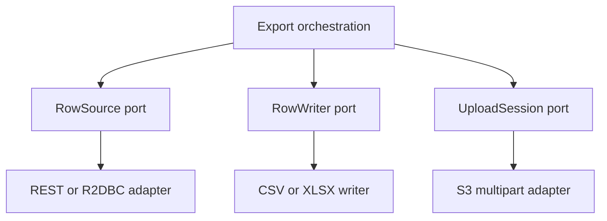

# Principles and patterns

This page maps OmniFlux Exchange to the first principles it is built on and to
the named patterns a reviewer will recognise. The tables name the implementing classes. Read [implementation status](../IMPLEMENTATION_STATUS.md#known-correctness-gaps) for the current limits of the lease, shutdown, and timeout mechanisms.

## 1. First principles

| # | Principle | Consequence in this codebase |
|---|---|---|
| P1 | **Memory must be O(1) in the size of the data.** | Every stage has a fixed buffer (page, writer, bridge chunk, upload part). Nothing collects a `List` of rows. R2DBC checks byte limits in SQL before retrieving values; REST checks decoded fields and rows within its codec limit. |
| P2 | **Bounded memory is back-pressure.** A buffer is only bounded if the producer waits when it is full. | Demand flows from the S3 upload back to the database cursor; Reactor prefetch is set to 1, and `DemandProbeTest` pins it. |
| P3 | **The disk is not a buffer.** | Export bytes stream directly to storage through hand-written OOXML and CSV writers. A read-only root filesystem and small tmpfs constrain accidental spooling. |
| P4 | **A timeout cannot distinguish slow from dead.** | Ownership comes from leases plus fencing tokens, never from "it has been too long". Every worker write is conditional on its claim token. |
| P5 | **Put each invariant where it can be enforced atomically.** | The global concurrency ceiling is enforced under a PostgreSQL row lock, not in pod memory; ownership checks live in the SQL `WHERE` clause. |
| P6 | **Fail at boot, not at 3 a.m.** | `StartupValidator` checks the memory arithmetic, the multipart part count, the cache TTL against bucket expiry, and the auth mode before the app accepts traffic. |
| P7 | **Separate the control plane from the data plane.** | Small JSON requests go through the API; large bytes go directly between storage and the browser via presigned URLs. |
| P8 | **Default deny.** | Relations are allowlisted (empty in production by default), columns and filters are validated against catalog metadata, values are bound parameters, and JWT mode refuses to boot rather than pretend to validate. |
| P9 | **Stateless compute, durable state elsewhere.** | Durable job state lives in PostgreSQL and results in object storage. Pods hold transient execution state; another pod can claim and restart recovered work. |
| P10 | **Classify failures by what retrying would achieve.** | `ErrorClass.DETERMINISTIC` fails immediately; `TRANSIENT` is retried up to `max-attempts`; unknown bugs become `INTERNAL_ERROR`, never a fake outage. |
| P11 | **Prove it by measurement.** | The proof harness records cgroup peak memory, OOM kills, and filesystem events from outside the JVM, and independently re-parses every exported file. |

## 2. Distributed-systems and cloud patterns

| Pattern | Where | Why |
|---|---|---|
| **Asynchronous Request-Reply** | `ExportController` returns `202 Accepted` + `Location`; clients poll `GET /api/jobs/{id}` | Exports take minutes; no connection is held open. |
| **Valet Key** | `PresignService` mints a short-lived presigned URL on each download request | Storage serves the bytes; the URL grants access to exactly one object for 15 minutes. |
| **Competing Consumers** | `JobQueuePoller` on every pod, `JobRepository.claim` with `FOR UPDATE SKIP LOCKED` | Horizontal scale without a broker. |
| **Admission control / global limiter** | `admission_gate` singleton row locked in the same transaction as the claim | Enforces `max-concurrent` across all replicas; `max-depth` sheds load with 429. |
| **Lease + fencing token** | `LeaseRenewer`, `claim_token` predicates in every worker transition, `ExpiredLeaseSweeper` | Fences writes after ownership changes. Lease-expiry publication and shutdown object-key gaps remain open; see Implementation status. |
| **Idempotent Receiver** | `Idempotency-Key` header, `JobRepository.submit` replay-or-conflict | Client retries do not create duplicate jobs. |
| **Retry with bounded attempts** | `markFailed` requeues `TRANSIENT` errors while `attempt_count < max-attempts` | Rides out blips without endless retries; exhausted jobs end `FAILED`, never lost. |
| **Compensating action** | Multipart abort on cancel or failure; `StartupReconciler` aborts uploads whose leases have expired | Partial work is cleaned up without distributed transactions. |
| **Scheduler-Agent-Supervisor** | Poller (scheduler), worker (agent), sweeper and reconciler (supervisors) | Recovery is a background responsibility, not a request-time concern. |
| **Cache-Aside with a content fingerprint** | `Fingerprint` + `ExportCacheResolver` (opt-in per relation) | An identical request for the same principal reuses a stored object and gets a fresh URL. |
| **Gateway Offloading** | `HEADER` auth mode, `HeaderPrincipalProvider` | Authentication lives in the platform gateway; the service validates the identity contract. |
| **Bulkhead** | Dedicated bounded `exportExecutor` for blocking writers, separate from the Netty event loop | A slow export cannot starve HTTP handling. |
| **Graceful degradation / drain** | `JobWorker` drain on shutdown, requeue without using up an attempt | Preserves the retry budget on shutdown; object-key reuse during handoff remains an open correctness gap. |
| **Health Endpoint Monitoring** | Actuator liveness and readiness; readiness includes the admission-gate check | The platform routes around misconfigured pods without restarting healthy ones. |

## 3. Data-access and streaming patterns

| Pattern | Where | Why |
|---|---|---|
| **Keyset pagination with a high-water mark** | `PgDialect`, `RestRowSource`: `pk > :after AND pk <= :highWater` | Avoids scanning skipped rows with `OFFSET`; a fixed upper key bounds the scan. Concurrent changes within that range can still affect the result. |
| **Pipes and Filters** | `ExportPipeline`: `RowSource` -> `RowWriter` -> `UploadSession` | Each stage has one job and a bounded buffer. |
| **Reactive Streams back-pressure** | Reactor `Flux` with demand-gated `outputStreamPublisher` bridge | Producers wait for consumers across thread and network boundaries. |
| **Bounded producer-consumer** | `ArrayBlockingQueue`-backed export executor; S3 upload buffer | The queue itself cannot grow without bound. |
| **Repository** | `JobRepository` over R2DBC `DatabaseClient` | SQL stays explicit and reviewable; no ORM session cache. |

## 4. Object-oriented (GoF) patterns

GoF means the classic "Gang of Four" design-pattern catalog. The Strategy pattern selects an implementation through a common interface; Factory centralizes object creation; Adapter connects an external system to a project interface; Decorator adds behavior around an existing object; Builder constructs an object step by step. The table maps those ideas to this project's classes.

| Pattern | Where |
|---|---|
| **Strategy** | `RowWriter` (`CsvRowWriter`, `XlsxStreamWriter`); `CurrentUserProvider` (`FixedPrincipalProvider`, `HeaderPrincipalProvider`); `DataApiCredentials` (`StaticDataApiCredentials`, `ClientCredentialsDataApiCredentials`); `CsvDialect` modes |
| **Factory** | `RowWriterFactory`, `ExportRowSourceFactory`, `SecurityProviderConfiguration` |
| **Adapter** | `adapter/rest/RestRowSource` and `adapter/r2dbc/R2dbcRowSource` behind the `RowSource` port; `SingleSubscriptionPublisher` |
| **Decorator** | `TimingOutputStream` (adds phase timing), `NonClosingOutputStream` (stops a writer closing the upload stream) |
| **Builder** | `TransferJob.builder()` |
| **Value Object** | Java records: `PrincipalKey`, `FilterSpec`, `ExportRequest`, `JobResult`, `ColumnDescriptor` |
| **Template / guard object** | `StartupValidator` runs an ordered list of invariant checks |
| **Test seam / fault injection** | `FailPoint` lets tests stop a job at named points (during the lease hold, after the upload completes) |

## 5. Architectural style

**Hexagonal (ports and adapters).** Export orchestration uses small interfaces
for source reading, output writing, and upload lifecycle:

[Open full-size diagram](../assets/diagrams/docs-architecture-principles-and-patterns-01.svg)

Adding a Db2 or Snowflake source, a Parquet writer, or a different object
store means adding an adapter. The pipeline, queue, and API stay as they are.

## 6. SOLID, briefly

- **Single responsibility:** the component table in
  [component boundaries](architecture.md#component-boundaries) lists what each component
  owns and, just as important, what it does not own.
- **Open/closed:** new sources, formats, and identity providers plug in
  through the ports above.
- **Liskov substitution:** `ExportScanContractTest` and the writer contract
  tests run the same expectations against each implementation.
- **Interface segregation:** ports are small, one or two methods each.
- **Dependency inversion:** the core depends on `RowSource`, `RowWriter`, and
  `UploadSession`; Spring configuration (`ExportRuntimeConfig`) wires the
  concrete adapters.

## 7. Trade-offs made deliberately

| Chosen | Over | Because | Cost accepted |
|---|---|---|---|
| PostgreSQL queue | Kafka or RabbitMQ | Gate, ownership, history, and fencing share one transaction | Row-lock throughput ceiling (ample at export rates) |
| Hand-written OOXML | Apache POI | POI spools to disk | We maintain an XLSX writer (one sheet, inline strings) |
| Integer keyset paging | Arbitrary sort keys | Bounded page size and a fixed upper key | Relations need an integer unique key |
| Gateway identity (`HEADER`) | Native JWT in v1 | Reuses the platform's auth | Security depends on network isolation until JWT lands |
| Restart a failed attempt from row 1 | Resume mid-file | S3 multipart parts cannot be safely resumed across owners | Long exports redo work after a crash |
