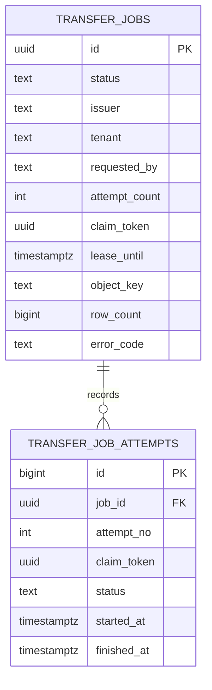

# Data model

Flyway migrations V1-V7 define the persistent model in PostgreSQL. The local `init-db/01-schema.sql` bootstraps the Compose fixture; Flyway remains the application migration mechanism. The demo relations are currently created by production migrations as well as used by the demo profile; they are not yet isolated into a demo-only migration location.

The diagram highlights job ownership and attempt coordination. The migration files define the complete schema.

[Open full-size diagram](assets/diagrams/docs-data-model-01.svg)

`admission_gate` has exactly one row (`id=1`); its row lock serializes cluster-wide admission decisions. `transfer_jobs` is the durable job and audit record. It stores a principal snapshot, normalized projection and filters, current state, lease/fencing information, result metadata, and current error. `object_key` is persisted; presigned URLs are created on demand and never stored. Idempotency is unique over direction, issuer, tenant, requested-by, and a non-null key.

`transfer_job_attempts` keeps each claimed worker attempt after the parent is requeued or retried. It has one row per `(job_id, attempt_no)` and records the claim token, worker, timestamps, outcome, result checksum, timing, and error. `ON DELETE CASCADE` ties its retention to the parent job.

`mock_customers`, `mock_orders`, and `mock_wide` are sample/benchmark relations with a `BIGINT` identity primary key, required by v1 keyset scans. `mock_wide` contains 200 nullable text columns. Their present placement in V1/V2 means they exist in production schemas unless migration policy is changed; see [Operations](OPERATIONS.md) and [Implementation status](IMPLEMENTATION_STATUS.md).

## Migration history

| Version | Change |
|---|---|
| V1 | Job table, singleton admission gate, indexes, idempotency key constraint, customers and orders fixtures |
| V2 | Order fixture columns, wide fixture relation, remove obsolete `schema_version`, notify PostgREST to reload schema |
| V3 | Ensure the admission gate singleton exists on upgraded databases |
| V4 | Normalize legacy error diagnostics and enforce valid error class |
| V5 | Persist timing snapshot on jobs |
| V6 | Add durable `transfer_job_attempts` history |
| V7 | Extend allowed job error codes with `VALIDATION_ERROR` and `INTERNAL_ERROR` |

The source migrations are authoritative. Do not edit historical migration files after they have been applied; add a forward migration for schema changes.
